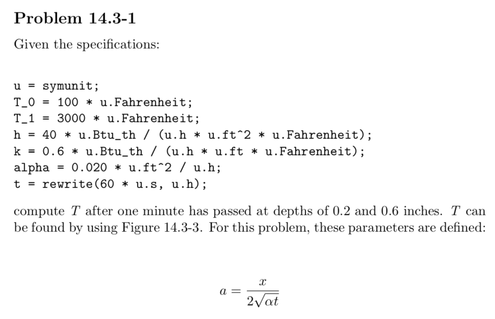

# autoreport

Automatically generate a LaTeX PDF from your homework problems! autoreport
will choose the file `header.m` to be the header of the report, and include
all m-files whose names inlude "problem" in the report. If a function is called
in the report and its source file is in the working directory, the function source
will be appended to the report.

## Getting Started

Follow these instructions to install the in-development version of autoreport.

### Prerequisites

+ MATLAB
+ A LaTeX installation with `pdflatex`

I use and recommend [TeX Live](https://www.tug.org/texlive/).

### Installing

To install the app in MATLAB, open the **APPS** tab in MATLAB and click the button
labelled **Install App**. Navigate to the autoreport folder and select `AutoReport.mlappinstall`.
Accept the MATLAB prompt to install autoreport. 

To install the function `autoreport.m`, simply copy it to a location on your MATLAB path. This allows
quick modification of the source file, for instance, changing the path to `pdflatex` based on your system.  

## Versioning

autoreport uses something like semantic versioning. Version 1.0.x will always construct
a typeset latex PDF with one button press, and has no runtime configuration.

## Authors

Author | Contact | Github
--- | --- | ---
Andrew Hoetker | ahoetker@me.com | [ahoetker](https://github.com/ahoetker)

## License
